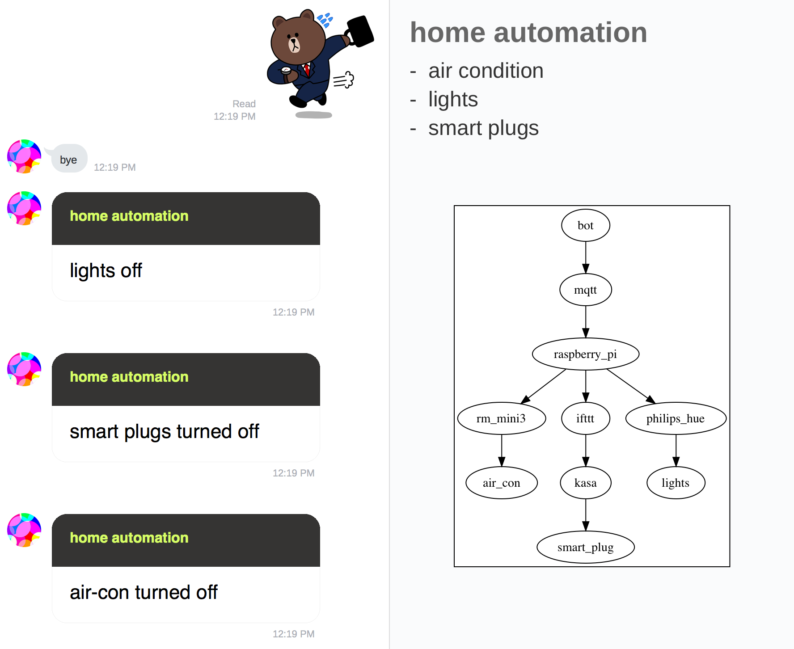
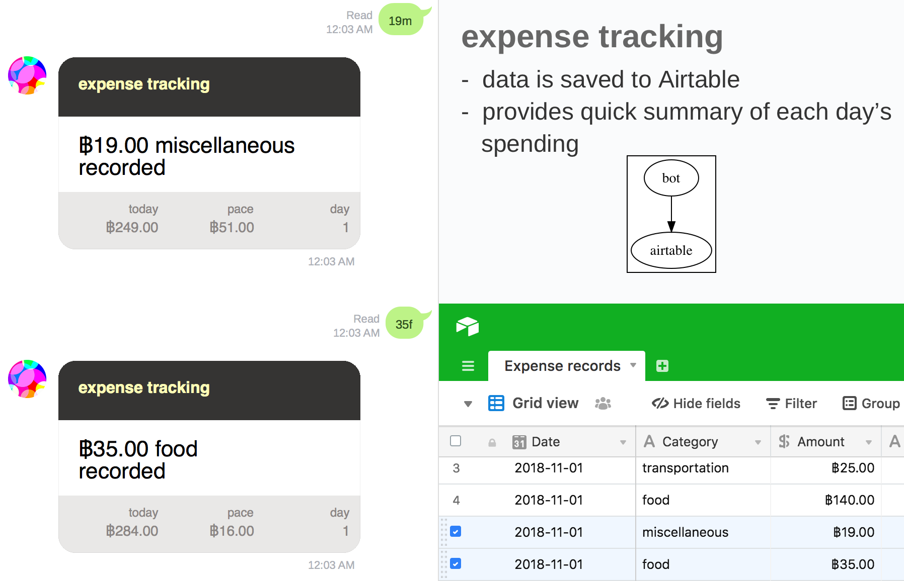
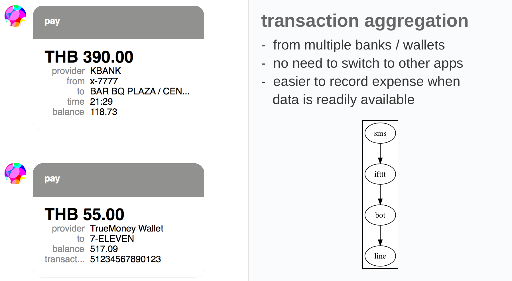
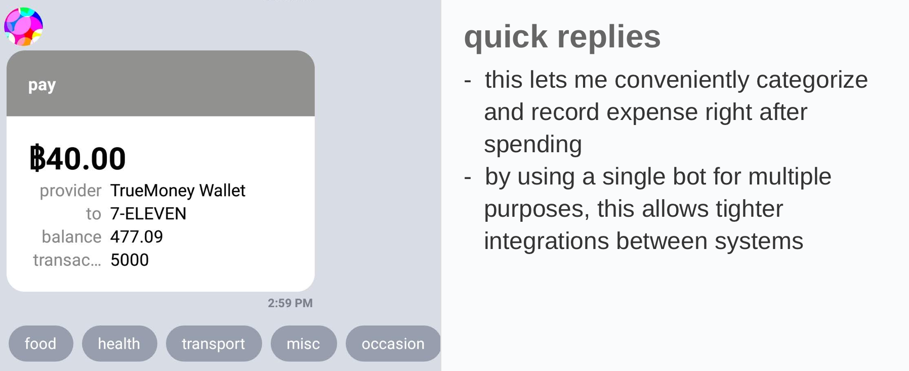
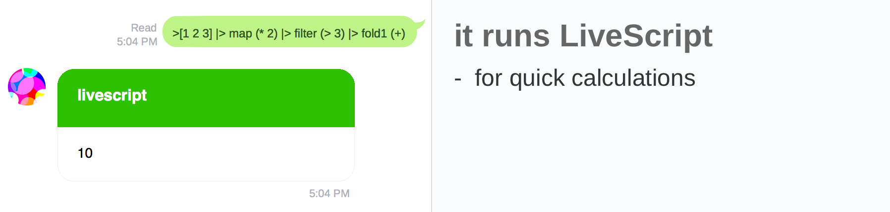
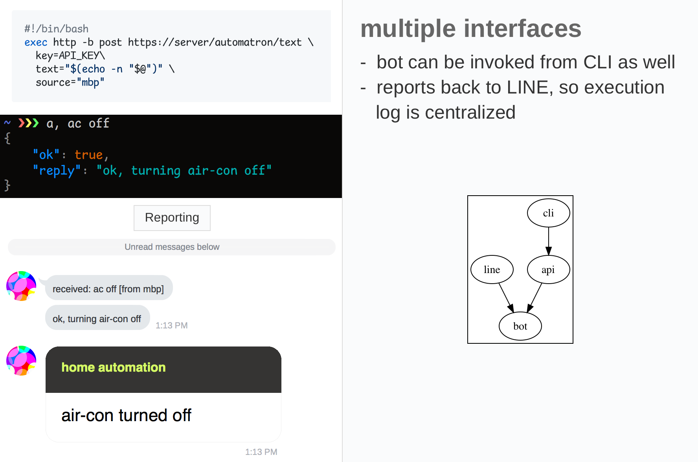

# automatron

This is the code of my LINE bot for personal use. It runs on [webtask.io](https://webtask.io/).

## features

- [home automation](#home-automation)
- [expense tracking](#expense-tracking)
- [transaction aggregation](#transaction-aggregation)
- [livescript evaluation](#livescript-evaluation)

### home automation

I have a Raspberry Pi set up which can [control lights](https://github.com/dtinth/hue.sh), [air conditioner](https://medium.com/@dtinth/remotely-turning-on-my-air-conditioner-through-google-assistant-1a1441471e9d), and [smart plugs](https://ifttt.com/services/kasa). It receives commands via [CloudMQTT](https://www.cloudmqtt.com/) and performs the action, then reports back to automatron via [its API](#cli-api).

### expense tracking

Simple expense tracking by typing in the amount + category. Example: 50f means ฿50 for food. Data is sent to [Airtable](https://airtable.com/).

### transaction aggregation

I [set up IFTTT to read SMS messages](https://ifttt.com/services/android_messages) and send it to automatron. It then uses [transaction-parser-th](https://github.com/dtinth/transaction-parser-th) to parse SMS message and extract transaction information. It is then sent to me as a [flex message](https://developers.line.me/en/docs/messaging-api/using-flex-messages/).

In mobile phone, [quick reply buttons](https://developers.line.me/en/docs/messaging-api/using-quick-reply/) lets me quickly turn a transaction into an expense record by simply tapping on the category.

Certain kinds of transactions can be automatically be turned into an expense, for example, when I [take BTS Skytrain using Rabbit LINE Pay card](https://brandinside.asia/rabbit-line-pay-bts/). Having many features in one bot enabled this kind of tight integrations.

### livescript evaluation

[LiveScript](https://livescript.net/) interpreter is included, which allows me to do some quick calculations.

### cli / api

`POST /text` sends a text command to automatron. This is equivalent to sending a text message through LINE. This allows me to create a CLI tool that lets me talk to automatron from my terminal.

`POST /post` sends a message to my LINE account directly. This allows the [home automation](#home-automation) scripts to report back to me whenever the script is invoked.

## secrets

Here is the list of [secrets](https://webtask.io/docs/editor/secrets) used in this webtask:

| name | explanation |
| ---- | ----------- |
| `API_KEY` | the secret key that must be sent with the request to use the [API](#cli-api) |
| `LINE_CHANNEL_SECRET` | self-explanatory |
| `LINE_CHANNEL_ACCESS_TOKEN` | self-explanatory |
| `LINE_USER_ID` | my user ID, so that the bot receives commands from me only |
| `MQTT_URL` | the URL to [CloudMQTT](https://www.cloudmqtt.com/) instance used for [home automation](#home-automation) |
| `AIRTABLE_API_KEY` | self-explanatory |
| `AIRTABLE_EXPENSE_BASE` | the ID of the Airtable base used for [tracking expenses](#expense-tracking) (should start with ‘app’) |
| `AIRTABLE_EXPENSE_URI` | the web URL to the Airtable base |
| `EXPENSE_PACEMAKER` | usage budget per day (rolls over to the next day) |
