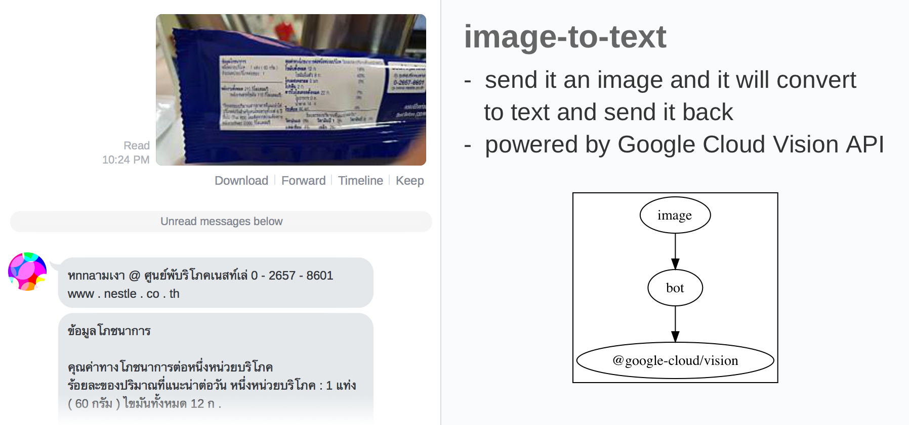

# automatron

This is my personal LINE bot that helps me automate various tasks of everyday life, such as
**home control** (air conditioner, lights and plugs) and **expense tracking** (record how much I spend each day).
[See below for a feature tour.](#features)

I recommend every developer to try creating their own personal assistant chat bot.
It’s a great way to practice coding and improve problem solving skills.
And it helps make life more convenient!

It is written in TypeScript and runs on [Google Cloud Run](https://cloud.google.com/run) on top of [evalaas](https://github.com/dtinth/evalaas) JavaScript-execution platform.

## features

- [home automation](#home-automation)
- [expense tracking](#expense-tracking)
- [transaction aggregation](#transaction-aggregation)
- [image-to-text](#image-to-text)
- [livescript evaluation](#livescript-evaluation)

### home automation


I have a Raspberry Pi set up which can [control lights](https://github.com/dtinth/hue.sh), [air conditioner](https://medium.com/@dtinth/remotely-turning-on-my-air-conditioner-through-google-assistant-1a1441471e9d), and [smart plugs](https://ifttt.com/services/kasa). It receives commands via [CloudMQTT](https://www.cloudmqtt.com/) and performs the action, then reports back to automatron via [its API](#cli-api).

### expense tracking


Simple expense tracking by typing in the amount + category. Example: 50f means ฿50 for food. Data is saved in [Airtable](https://airtable.com/).

On mobile, tapping the bubble’s body (containing the amount) will take me to the created Airtable record. This allows me to easily edit or add remarks to the record. Tapping the bubble’s footer (containing the stats) will take me to Airtable view, which lets me see all the recorded data.

### transaction aggregation


I [set up IFTTT to read SMS messages](https://ifttt.com/services/android_messages) and send it to automatron. It then uses [transaction-parser-th](https://github.com/dtinth/transaction-parser-th) to parse SMS message and extract transaction information. It is then sent to me as a [flex message](https://developers.line.me/en/docs/messaging-api/using-flex-messages/).


In mobile phone, [quick reply buttons](https://developers.line.me/en/docs/messaging-api/using-quick-reply/) lets me quickly turn a transaction into an expense record by simply tapping on the category.


Certain kinds of transactions can be automatically be turned into an expense, for example, when I [take BTS Skytrain using Rabbit LINE Pay card](https://brandinside.asia/rabbit-line-pay-bts/). Having many features in one bot enabled this kind of tight integrations.

### image-to-text



automatron can also convert image to text using [Google Cloud Vision API](https://cloud.google.com/vision/).

### livescript evaluation


[LiveScript](https://livescript.net/) interpreter is included, which allows me to do some quick calculations.

### cli / api


`POST /text` sends a text command to automatron. This is equivalent to sending a text message through LINE. This allows me to create a CLI tool that lets me talk to automatron from my terminal.

`POST /post` sends a message to my LINE account directly. This allows the [home automation](#home-automation) scripts to report back to me whenever the script is invoked.

## secrets

The secret data required to run the automation are defined in [BotSecrets.ts](./src/BotSecrets.ts).

## development workflow

### developing

Watches for file changes and deploy the compiled code. Since it is my personal bot (I am the only one using it), I want a save-and-deploy workflow; there is no dev/staging environment at all.

```sh
node dev
```

### configuration

```sh
# download
gsutil cp gs://$GOOGLE_CLOUD_PROJECT-evalaas/evalaas/automatron.env automatron.env

# upload
gsutil cp automatron.env gs://$GOOGLE_CLOUD_PROJECT-evalaas/evalaas/automatron.env
```
